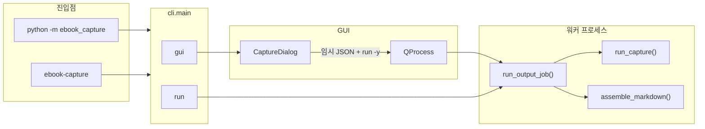
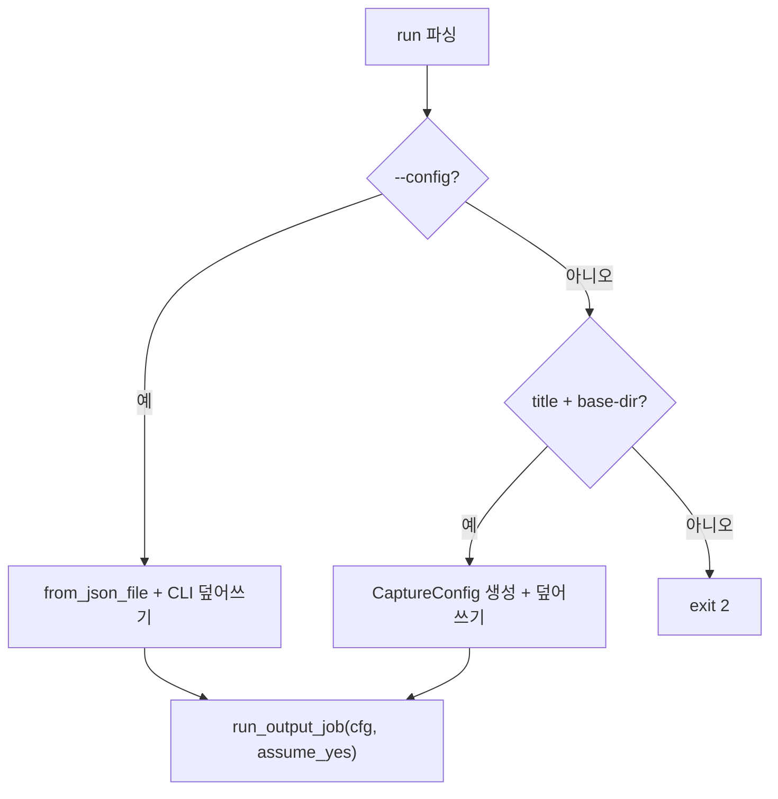

# ebook_capture CLI · GUI 동작 흐름

현재 코드 기준 **`python -m ebook_capture`** 진입 이후의 분기와 파이프라인을 정리한다.  
사용자용 옵션 표는 [`USAGE.md`](USAGE.md)를 본다.

---

## 1. 전체 개요

- **단일 파이프라인**: 캡처·OCR·PDF는 `core.pipeline.run_capture()`. Markdown은 `core.assemble_markdown.assemble_markdown()`.
- **job planning**: `core.job_plan.plan_job()`이 `output_mode`와 기존 파일을 보고 필요한 단계를 정한다. `confirm_steps()`로 확인 (`-y`면 생략).
- **GUI**는 `QProcess`로 `run -y --config …`만 실행한다 (비대화형 터미널 대응).

---

## 2. CLI (`cli.py`)

### 서브커맨드

| 명령 | 핸들러 | 설명 |
|------|--------|------|
| `gui` | `_cmd_gui` | PyQt5 GUI |
| **`run`** | `_cmd_run` | `--images` / `--pdf` / `--text` |

### `run` 설정 해석

- `--config` JSON을 읽은 뒤, 같은 명령의 CLI 플래그(`--title`, `--pdf`, `--text`, …)가 있으면 **덮어씀**.
- `output_mode`는 `--images` / `--pdf` / `--text` 또는 `--output`으로 지정.

---

## 3. Job runner (`core/job_runner.py`)

1. `plan_job(cfg)` → `(steps, planned_cfg)`
2. `confirm_steps(steps, assume_yes=…)` — 빈 plan이면 "Nothing to do" 후 종료
3. capture/OCR/PDF 단계가 있으면 `run_capture(planned_cfg)`
4. `ASSEMBLE` 단계가 있으면 `assemble_markdown(...)`

---

## 4. Job plan (`core/job_plan.py`)

`output_mode`별 계획:

| output | 가능한 단계 |
|--------|-------------|
| **images** | CAPTURE (PNG 없거나 `--force-phase capture`) |
| **pdf** | CAPTURE → BUILD_PDF |
| **text** | CAPTURE → OCR_FROM_PNG, 또는 OCR_FROM_PNG / OCR_FROM_PDF, 또는 ASSEMBLE만 |

**text** OCR 소스 우선순위:

1. `tmp/{title}_*.png` → OCR_FROM_PNG
2. `{title}.pdf` 또는 `--input-pdf` → OCR_FROM_PDF
3. 캡처 설정 가능 → CAPTURE + OCR_FROM_PNG

assemble: `{title}.md` 없거나 `--force-phase ocr` 시 ASSEMBLE.

---

## 5. 설정 (`core/config.py`)

| 필드 | 의미 |
|------|------|
| `output_mode` | `images` \| `pdf` \| `text` |
| `assemble_style` | `full` \| `prose` \| `raw` (text 출력 시 Markdown) |
| `skip_capture` | True면 캡처 생략 (plan_job / PDF-only 등에서 설정) |
| `input_pdf` | text 모드 PDF OCR 소스 |
| `resume` / `force_phase` | 페이지 단위 skip / 강제 재실행 |

Phase 실행 여부는 `@property`로 파생:

- `run_capture_phase` — `skip_capture`가 아니고 PDF 입력이 아닐 때
- `run_ocr_phase` — `output_mode == text`
- `run_pdf_phase` — `output_mode == pdf` 이고 캡처 skip 아님

경로:

- 출력: `{base_dir}/{title}/`
- 임시: `{base_dir}/{title}/tmp/`
- 상태: `{base_dir}/{title}/capture_state.json`

---

## 6. 파이프라인 (`core/pipeline.py`)

순차 실행 (해당 phase가 켜진 경우만):

1. **Capture** — PNG → `tmp/{title}_NNNN.png`
2. **OCR** (text) — Gemini → `*.ocr.json`, `*_ocr.txt`
3. **PDF** (pdf) — `core/image_pdf.py` → `{title}.pdf`

Resume: `capture_state.json` + 파일 검증. `.part` 쓰기 후 rename.

---

## 7. GUI (`gui/app.py`)

| 동작 | 서브프로세스 |
|------|----------------|
| Start | `python -m ebook_capture run -y --config <tmp.json>` |
| Assemble MD | `run -y --config … --style …` (`output_mode=text` 강제) |

- `PYTHONPATH`에 저장소 루트 추가 (editable 미설치 개발용).
- stdout/stderr → 로그 창.

---

## 8. 소스 빠른 참조

| 파일 | 역할 |
|------|------|
| `cli.py` | argparse, `run` / `gui` |
| `core/job_plan.py` | 산출물 분석, 단계 계획, 확인 프롬프트 |
| `core/job_runner.py` | plan → confirm → pipeline / assemble |
| `core/pipeline.py` | 캡처 · OCR · PDF |
| `core/assemble_markdown.py` | OCR JSON → `.md` |
| `core/image_pdf.py` | PNG → 이미지 PDF |
| `gui/app.py` | PyQt + QProcess |

---

*동작 변경 시 이 파일과 `USAGE.md`를 함께 수정할 것.*
