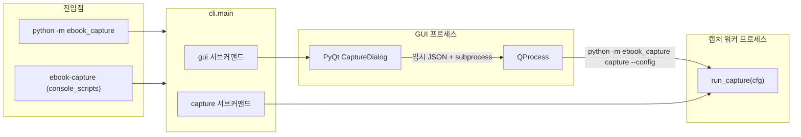
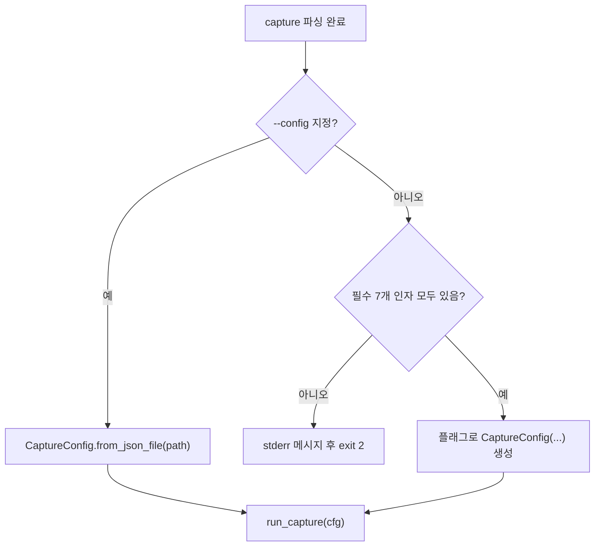
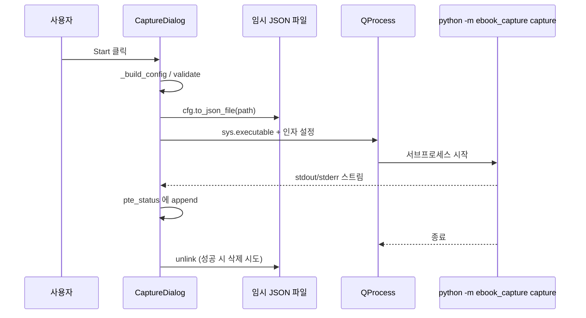

# ebook_capture CLI · GUI 동작 흐름

이 문서는 현재 코드 기준으로 **`python -m ebook_capture`** 진입 이후의 분기, 데이터 구조, 파이프라인 단계를 정리한다.

---

## 1. 전체 개요

- **단일 구현**: 실제 작업은 모두 `core.pipeline.run_capture()` 에서 수행된다.
- **GUI는 라이브러리 호출이 아니라 별도 프로세스로 CLI를 실행**한다 (`QProcess`). 따라서 GUI 프로세스와 캡처 프로세스의 메모리는 분리된다.

---

## 2. 진입점과 모듈 로딩

| 경로 | 동작 |
|------|------|
| `__main__.py` / `ebook_capture.py` | `cli.main()` 호출 후 종료 코드로 반환 |
| `pyproject.toml` 의 `ebook-capture` | 동일하게 `ebook_capture:main` 진입 |

**지연 로딩**

- `capture` 서브커맨드가 실행될 때만 `core.pipeline` 이 import 된다 (`cli._cmd_capture` 내부). `--help` 만 볼 때는 `pyautogui` 등 무거운 의존성이 필요 없다.
- `gui` 서브커맨드는 `_cmd_gui` 안에서만 `gui.app.run_gui` 를 import 한다.

---

## 3. CLI (`cli.py`)

### 3.1 서브커맨드 분기

`argparse` 로 `command` 를 필수 서브파서로 둔다 (`required=True`).

1. **`gui`**
   - 핸들러: `_cmd_gui`
   - `run_gui()` 호출 → 내부에서 `QApplication` 실행 후 **블로킹** (`sys.exit(app.exec_())`).
   - 반환값 `0` 은 프로세스가 창을 닫은 뒤에나 의미가 있다.

2. **`capture`**
   - 핸들러: `_cmd_capture`
   - 설정 객체 `CaptureConfig` 를 만든 뒤 `run_capture(cfg)` 반환값을 그대로 프로세스 종료 코드로 사용 (현재 파이프라인은 성공 시 `0`).

### 3.2 `capture` 의 두 가지 입력 방식

**`--config` 가 있을 때**

- JSON 파일 내용을 `from_mapping` 규칙으로 읽는다 (`core/config.py`).
- **다른 CLI 플래그는 사용하지 않는다** (설계상 `--config` 가 우선).

**`--config` 가 없을 때 (필수)**

- `--pages`, `--base-dir` 필요. `--title`은 생략 가능하며 기본값 `unknown` 사용.
- `capture` phase를 실행할 때는 `--left`, `--top`, `--width`, `--height`도 필요.
- 선택값 기본:
  - `--delay` 없음 → `delay_sec = 1.0`
  - `--next-key` 없음 → `"pagedown"`
  - `--pdf-image` / `--images` / `--text` / `--pdf-searchable` / `--audio` 로 출력 모드 선택
  - 기본 출력 모드는 `--pdf-image` (`output_mode=pdf_image`)
  - `--no-images`, `--no-pdf`, `--ocr` 는 레거시 호환 옵션
  - `--voice` 는 `store_true` (기본 `False`)
  - `--phase capture|ocr|pdf|all` 로 실행 단계를 제한

---

## 4. 설정 모델 (`core/config.py`)

### 4.1 `CaptureConfig` 필드 의미

| 필드 | 의미 |
|------|------|
| `title` | 책/작업 이름. 출력 경로에 사용 |
| `n_pages` | 캡처할 페이지 수 (루프 횟수) |
| `base_dir` | **상위 출력 폴더** (절대 경로 검증) |
| `rect` | 화면 상 직사각형 (`left`, `top`, `width`, `height`) |
| `delay_sec` | 페이지 넘김 키 입력 후 대기 (초) |
| `next_key` | `pyautogui.press(next_key)` 에 그대로 전달되는 문자열 |
| `capture_images` / `run_capture_phase` | Phase I 스크린샷 수행 여부 |
| `ocr` / `run_ocr_phase` | Phase II Google Gemini OCR txt/json 여부 |
| `output_mode` | `images`, `text`, `pdf_image`, `pdf_searchable`, `audio` |
| `build_pdf` / `run_pdf_phase` | Phase III PDF 생성 여부(일반 또는 searchable) |
| `resume` | 기존 산출물과 manifest 기준 skip 여부 |
| `force_phase` | 특정 phase 강제 재생성 |
| `ocr_lang` | Google OCR 언어 힌트 (예: `kor`, `eng`) |
| `voice` | Phase IV Google TTS 여부 |
| `voice_lang_code`, `voice_model`, `voice_gender` | TTS 파라미터 |

### 4.2 디렉터리·파일 접두사

- 최종 산출물 디렉터리: **`{base_dir}/{title}/`** (`output_dir()`).
- 임시 페이지 산출물 디렉터리: **`{base_dir}/{title}/tmp/`** (`tmp_dir()`).
- 페이지 파일 접두사: **`{tmp_dir}/{title}`** (`prefix_path()`).
- 최종 파일 접두사: **`{output_dir}/{title}`** (`final_prefix_path()`).

예: `title="MyBook"`, `base_dir="D:/b"` 이면 PNG 는 대략  
`D:/b/MyBook/tmp/MyBook_0000.png` 형태.

### 4.3 `validate()`

- 제목 비어 있음, 페이지 수 범위(1~10000), 가로·세로 1 미만, `base_dir` 이 절대 경로가 아닌 경우 → `ValueError`.
- Windows 에서 `D:\...` 는 `Path.drive` 가 있어 통과; 유닉스 에서 `/home/...` 는 `is_absolute()` 로 통과.

### 4.4 JSON 직렬화

- `dataclasses.asdict` 로 평면화되며 `rect` 는 중첩 dict 로 저장된다.
- GUI·CLI 공통 스키마로 **서브프로세스 `--config` 전달**에 사용된다.

---

## 5. GUI (`gui/app.py`)

### 5.1 시작: `run_gui()`

1. `QApplication` 생성, 고해상도 관련 Qt 속성 설정.
2. `CaptureDialog` 생성 → `Ui_Dialog().setupUi` 로 `capture.ui` 생성 코드 기반 레이아웃 적재.
3. `qtmodern` 이 있으면 `ModernWindow` 로 감싸고, 없으면 다이얼로그만 표시.
4. 이벤트 루프 실행 후 프로세스 종료.

### 5.2 초기화 시 데이터

- `assets/ocr_lang.csv` → OCR 언어 힌트 콤보 (`lang` 표시, `code` 는 `_ocr_code()` 로 조회).
- `voice_lang.csv` → 음성 콤보 (`desc` 표시, 선택 행에서 `code`, `model`, `gender` 추출).
- 기본값: OCR 은 `code == eng` 인 행으로 인덱스 설정, 음성은 첫 항목, 폴더 `D:/`, 딜레이 `1.0`, 이미지·PDF 체크 온.

### 5.3 영역 선택 (`_pick_region`)

1. `SnippingWidget` 전체화면에 가깝게 표시 (상단 유지·프레임리스).
2. 사용자 드래그 후 `getRect().normalized()` 를 `_rect_norm` 에 저장.
3. 상태 창(`pte_status`)에 영역 문자열 출력.

### 5.4 설정 조립 (`_build_config`)

위젯 → `CaptureConfig` 매핑 규칙:

- **검증 (실패 시 `None` + 메시지 박스)**  
  - 영역 없음 또는 가로·세로가 2 미만  
  - 제목 빈 문자열  
  - 출력 폴더가 절대 경로가 아님 (`Path.is_absolute()` 기준)  
  - 페이지 수 &lt; 1  
- **Next 키**: `cb_next` 의 인덱스를 `NEXT_KEY_BY_INDEX` 로 매핑 (순서대로 `pagedown`, `pagedown`, `down`, `right`, `space`, `enter`). 인덱스 범위는 클램프.
- **OCR 언어**: 주 콤보 표시 문자열 → CSV 에서 `code`.
- **음성**: 현재 `desc` 행 → `code`(언어 코드), `model`, `gender`.

### 5.5 작업 시작 (`_start_capture`)

1. 이미 `QProcess` 가 돌아 중이면 `"Busy"` 메시지 후 return.
2. `cfg.validate()` 재확인.
3. `tempfile.mkstemp` 로 **`ebook_capture_*.json`** 경로 확보 후 `cfg.to_json_file`.
4. `QProcess`:
   - **실행 파일**: `sys.executable` (현재 파이썬 인터프리터).
   - **인자**: `-m`, `ebook_capture`, `capture`, `--config`, `<절대경로 JSON>`.
   - **환경**: `_python_env()` — 시스템 환경 복사 후 **`PYTHONPATH` 앞에 저장소 루트**를 붙임 (`gui/app.py` 의 `_repo_root()` = 프로젝트 루트).  
     → `pip install -e .` 없이 개발 트리에서도 `-m ebook_capture` 를 찾기 위함.
5. `readyReadStandardOutput` / `readyReadStandardError` 로 읽은 내용을 로그 창에 추가.
6. `finished` 시 종료 코드 로그, 임시 JSON 파일 삭제 시도.

### 5.6 취소 (`_cancel_job`)

- 실행 중인 프로세스가 있으면 `kill()` 호출 (강제 종료).

---

## 6. 파이프라인 (`core/pipeline.py`)

모든 단계는 **같은 프로세스** 안에서 순차 실행된다. 로그는 `print(..., flush=True)` 로 표준 출력에도 나가 GUI 서브프로세스가 그대로 읽는다.

### Phase I — 이미지 캡처 (`run_capture_phase`)

- 조건: `cfg.run_capture_phase`
- 루프: `i = 0 .. n_pages-1`
  - `PrintWindow` 또는 `screenshot_region(...)` → `{tmp}/{title}_{page:04d}.png`
  - 마지막 페이지가 아니면 `pyautogui.press(cfg.next_key)` 후 `time.sleep(cfg.delay_sec)`
- resume 시 유효한 PNG와 manifest `done`이 있으면 skip.

### Phase II — OCR 텍스트/좌표 (`run_ocr_phase`)

- 조건: `cfg.run_ocr_phase`
- `google_ocr.extract_layout_from_image()`:
  - PNG를 Google Gemini API로 전송해 OCR 텍스트와 normalized bbox 추출
  - 페이지별 텍스트를 **`{tmp}/{title}_{page:04d}.txt`** 에 저장
  - 페이지별 구조화 결과를 **`{tmp}/{title}_{page:04d}.ocr.json`** 에 저장
  - 통합 결과를 **`{output}/{title}_ocr.txt`** 에 저장

### Phase III — PDF (`run_pdf_phase`)

- 조건: `cfg.run_pdf_phase`
- `cfg.output_mode`가 `pdf_searchable`인 경우:
  - `searchable_pdf.build_page_searchable_pdf()` 사용
  - OCR JSON bbox를 PDF 좌표로 변환해 invisible text layer 생성
  - 페이지 PDF를 **`{tmp}/{title}_{page:04d}.searchable.pdf`** 에 저장
- 그 외 PDF 모드(`pdf_image`)는:
  - `searchable_pdf.build_page_image_pdf()` 사용
  - OCR 없이 이미지 페이지 PDF 생성
  - 페이지 PDF를 **`{tmp}/{title}_{page:04d}.page.pdf`** 에 저장
- 공통:
  - 전체 PDF를 **`{output}/{title}.pdf`** 로 병합
  - PNG의 DPI 메타데이터를 읽어 PDF page size(pt)를 계산하므로 변환 시 물리 배율이 유지됨

### Phase IV — 음성 (`voice`)

- 조건: `cfg.voice`
- 페이지별:
  - `.txt` 가 있으면 읽고, 없으면 PNG 에서 Google OCR로 추출 후 파일에 저장.
  - `core/tts.synthesize_to_mp3` 로 `{tmp}/{title}_{page:04d}.mp3`
- 전 페이지 MP3 를 `merge_mp3_files` 로 **`{output}/{title}_voice.mp3`**

### Resume

- 상태 파일: `{output}/capture_state.json`
- 각 phase는 페이지 단위로 `done`/`failed`를 기록한다.
- 산출물은 `.part`에 먼저 쓰고 성공 시 rename한다.
- `--resume` 기본값에서는 manifest와 산출물 검증이 모두 통과한 페이지를 skip한다.
- `--force-phase capture|ocr|pdf|voice|all`은 지정 phase의 skip을 무시한다.

### 반환값

- 현재 구현은 중간 실패 시에도 예외가 나기 전까지 진행; 정상 완료 시 **`0`**.

---

## 7. GUI ↔ CLI 경계 정리

| 항목 | GUI 프로세스 | 캡처 CLI 프로세스 |
|------|----------------|-------------------|
| Qt | 있음 | 없음 |
| `run_capture` 직접 호출 | 없음 | 있음 |
| 설정 전달 | 임시 JSON 파일 | `--config` |
| 작업 디렉터리 | `QProcess` 기본 (보통 CWD) | 동일 (미설정) |
| `PYTHONPATH` | 자식에 루트 추가 | 부모가 넘긴 환경 상속 |

---

## 8. 관련 소스 파일 빠른 참조

| 파일 | 역할 |
|------|------|
| `cli.py` | 서브커맨드·인자 파싱·`run_capture` 호출 |
| `core/config.py` | `CaptureConfig` / `Rect`, JSON |
| `core/google_ocr.py` | Google Gemini API 기반 OCR |
| `core/pipeline.py` | 실제 캡처·OCR·검색 PDF·TTS 순서 |
| `core/searchable_pdf.py` | OCR JSON 기반 검색 PDF text layer 생성 |
| `core/tts.py` | Google TTS + pydub 병합 |
| `gui/app.py` | 다이얼로그·`QProcess`·CSV 매핑 |
| `gui/snipping.py` | 영역 선택 위젯 |
| `gui/ui_capture.py` | Qt Designer 생성 UI 클래스 |

---

*문서 버전: 저장소의 CLI/GUI 구현과 동기화. 동작 변경 시 이 파일도 함께 수정할 것.*
