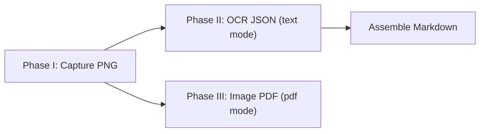

# ebook_capture Implementation & Reuse Guide

> **CLI·출력 옵션:** [`USAGE.md`](USAGE.md)가 기준이다.

이 문서는 `ebook_capture`에서 해결한 화면 캡처, RDP/DPI 좌표계, Google Gemini OCR, 사내망 인증서, 이미지 PDF, Markdown assemble, resume 가능한 파이프라인, CLI/GUI 분리, 로그 표준을 다른 프로젝트에서도 재사용할 수 있도록 정리한 구현 가이드입니다.

## 0. 해결한 문제와 재사용 포인트

이 프로젝트에서 실제로 해결한 핵심 문제는 다음과 같다.

| 영역 | 해결한 문제 | 재사용할 구현 단위 |
|---|---|---|
| Windows/RDP 캡처 | RDP, DPI scaling, 다중 모니터에서 검은 이미지 또는 잘못된 rect 캡처 | `core/windows_util.py`, `core/win32_bitmap_capture.py`, `core/screen_capture.py` |
| 캡처 좌표 안정화 | foreground window, client rect, frame rect, left/right third crop | `CaptureConfig`, `resolve_screen_rect()`, `capture_client_printwindow()` |
| 마우스 커서 | 캡처 이미지에 커서가 찍히는 환경 대응 | `hide_cursor_during_capture`, cursor move/restore 로직 |
| Google OCR | Tesseract 제거, Gemini 기반 OCR, model 교체 가능 구조 | `core/google_ocr.py` |
| 사내망 SSL | 보안 프록시/사내 CA 때문에 Google API TLS 실패 | `truststore`, `certifi`, PEM/DER `.cer` 로딩 |
| PDF 생성 | PNG → 이미지 PDF | `core/image_pdf.py`, `reportlab` |
| Markdown | OCR JSON → `.md` | `core/assemble_markdown.py` |
| 중단 후 재실행 | 캡처/OCR/PDF 단계별 resume | `capture_state.json`, `.part` atomic write, `--force-phase` |
| CLI/GUI 분리 | GUI가 캡처 중 freeze되거나 Qt 의존성이 core에 섞이는 문제 | GUI는 `QProcess`, core는 headless pipeline |
| 로그/디버깅 | 사용자와 개발자가 원인 추적 가능한 로그 | `DEBUG_RECT`, `IMAGE_OK`, `OCR_FAIL`, `PDF_PAGE_OK` 등 |

다른 프로젝트로 옮길 때는 다음 순서로 가져가는 것을 권장한다.

1. `core/config.py`의 config/dataclass/path helper 패턴을 먼저 이식한다.
2. 외부 API 호출은 한 모듈에 모은다. 이 프로젝트에서는 `core/google_ocr.py`가 그 역할을 한다.
3. 파일 생성은 `.part`에 쓰고 성공 후 rename한다.
4. 페이지 단위 작업은 manifest에 `done`/`failed`를 기록한다.
5. GUI가 있더라도 긴 작업은 subprocess/worker로 분리한다.

### 전체 파이프라인



저장 경로 표준:

- 임시 페이지 파일: `output/{title}/tmp/{title}_{page:04d}.png`, `.ocr.json`, `.page.pdf`
- 최종 파일: `output/{title}/{title}.pdf`, `{title}.md`, `{title}_ocr.txt`
- 상태 파일: `output/{title}/capture_state.json`

출력 모드 (`output_mode` / `run --images|pdf|text`):

- `images`: PNG만 생성
- `pdf`(기본): PNG + 이미지 PDF
- `text`: OCR JSON + Markdown (`run --text` 한 번에 assemble 포함)

기본 제목:

- title 인자가 없거나 비면 `unknown`을 사용한다.

resume 표준:

- 모든 page 산출물은 검증 가능한 파일 단위로 만든다.
- 쓰기 중단에 대비해 `.part` 파일로 먼저 저장하고 `os.replace()`로 rename한다.
- manifest만 믿지 말고 실제 파일 검증도 함께 수행한다.
- `--force-phase capture|ocr|pdf|all`로 특정 단계 재생성을 허용한다.

## 1. 기본 원칙

- API 키, 인증서, 서비스 계정 경로는 코드에 하드코딩하지 않는다.
- 모든 민감 설정은 `.env` 또는 OS 환경변수로 주입한다.
- `.env`는 저장소에 커밋하지 않는다.
- Google API 호출은 `core.google_ocr` 한 경로로 모은다.
- OCR 실패가 전체 캡처 이미지를 망치지 않도록, 캡처 Phase I, OCR Phase II, PDF Phase III를 명확히 분리한다.
- 사내망과 open망은 같은 코드로 동작해야 하며, 네트워크 차이는 환경변수로 전환한다.
- GUI는 설정 수집과 로그 표시만 담당하고, 실제 캡처/OCR/PDF 작업은 CLI subprocess에서 실행한다.
- 최종 산출물과 임시 산출물을 디렉터리 레벨에서 분리한다.
- PDF 생성 시 PNG DPI 메타데이터를 사용해 변환 후 물리 크기/배율을 보존한다.

## 2. Google API 표준

Google Gemini API는 `doc_metadata` 프로젝트와 같은 방식으로 사용한다.

```python
from dotenv import load_dotenv
from google import genai

load_dotenv(override=True)
client = genai.Client(api_key=os.getenv("GOOGLE_API_KEY"))
```

이 프로젝트에서는 위 로직을 직접 반복하지 말고, 반드시 다음 모듈을 사용한다.

```python
from core.google_ocr import extract_layout_from_image, extract_text_from_image
```

사용 기준:

- plain text만 필요하면 `extract_text_from_image()`를 사용한다.
- layout JSON 또는 위치 기반 후처리가 필요하면 `extract_layout_from_image()`를 사용한다.
- 다른 프로젝트에서 OCR provider를 바꾸더라도 pipeline은 `{text, blocks[{text, bbox}]}` 형태만 의존하도록 유지한다.

현재 기본 모델은 다음과 같다.

```text
gemini-2.5-flash
```

`gemini-2.0-flash`는 신규 사용자에게 `404 NOT_FOUND`가 발생할 수 있으므로 기본값으로 쓰지 않는다.

모델명은 `.env`에서 override할 수 있다.

```env
GOOGLE_OCR_MODEL=gemini-2.5-flash
```

모델 변경 정책:

- Google 모델은 deprecated될 수 있으므로 코드에 여러 위치로 하드코딩하지 않는다.
- 기본값은 `google_ocr.DEFAULT_GOOGLE_OCR_MODEL` 한 곳에서 관리한다.
- 운영 중 `404 NOT_FOUND`가 발생하면 먼저 `GOOGLE_OCR_MODEL`만 바꿔 복구한다.
- 모델 변경 후 `Google API 연결 테스트`와 `OCR 1페이지 테스트`를 모두 수행한다.

## 3. `.env` 표준

최소 설정:

```env
GOOGLE_API_KEY=your_google_api_key
GOOGLE_OCR_MODEL=gemini-2.5-flash
GOOGLE_API_TRUST_MODE=auto
```

사내망에서 인증서 문제가 있으면:

```env
GOOGLE_API_TRUST_MODE=system
```

또는 별도 CA 파일을 지정한다.

```env
GOOGLE_API_CA_BUNDLE=D:\projects\ebook_capture\company-ca-bundle.pem
```

open망에서 공개 CA만 쓰려면:

```env
GOOGLE_API_TRUST_MODE=certifi
```

### `.env` 탐색 순서

`google_ocr.py`는 아래 위치를 순서대로 로드한다.

- 현재 작업 디렉터리의 `.env`
- `ebook_capture` 프로젝트 루트의 `.env`
- sibling 프로젝트인 `doc_metadata/.env`
- 기본 `load_dotenv(override=True)` 탐색 결과

중복 키가 있으면 나중에 로드된 값이 우선한다.

예시는 `.env.example`을 참고한다. 실제 `.env`는 커밋하지 않는다.

## 4. 인증서/SSL 표준

`GOOGLE_API_TRUST_MODE` 값:

| 값 | 의미 | 권장 환경 |
|---|---|---|
| `auto` | OS 인증서 저장소를 우선 사용, 없으면 `certifi` fallback | 기본 |
| `system` | OS 인증서 저장소만 사용 | 사내망, 보안 프록시 |
| `certifi` | 공개 CA bundle만 사용 | open망 |

구현은 다음 기준을 따른다.

- Windows 사내망에서는 `truststore`로 Windows 인증서 저장소를 우선 사용한다.
- open망에서는 `certifi`만으로 동작 가능해야 한다.
- `GOOGLE_API_CA_BUNDLE` 또는 `SSL_CERT_FILE`은 선택 설정이다.
- CA 파일은 PEM bundle 또는 Windows에서 export한 DER `.cer` 모두 허용한다.
- DER `.cer`는 `ssl.DER_cert_to_PEM_cert()`로 메모리에서 변환해 로드한다.

## 5. 인증서 Export

Windows 루트 인증서 목록:

```powershell
Get-ChildItem Cert:\LocalMachine\Root | Select-Object Subject, Thumbprint
```

사용자 루트 저장소:

```powershell
Get-ChildItem Cert:\CurrentUser\Root | Select-Object Subject, Thumbprint
```

예: Cato 또는 사내 프록시 인증서 export:

```powershell
$cert = Get-ChildItem Cert:\LocalMachine\Root |
  Where-Object { $_.Subject -like "*Cato Networks Root CA*" } |
  Select-Object -First 1

Export-Certificate -Cert $cert -FilePath D:\projects\ebook_capture\cato-root.cer -Type CERT
```

여러 인증서를 하나의 bundle로 합칠 때:

```powershell
Get-Content D:\projects\ebook_capture\cato-root.cer, D:\projects\ebook_capture\cato-ca.cer |
  Set-Content D:\projects\ebook_capture\company-ca-bundle.pem
```

`.env`:

```env
GOOGLE_API_CA_BUNDLE=D:\projects\ebook_capture\company-ca-bundle.pem
```

## 6. Google API 연결 테스트

API 키와 인증서 설정만 확인:

```powershell
python -c "from core.google_ocr import _client; c=_client(); print(type(c).__name__)"
```

Gemini 실제 호출:

```powershell
python -c "from core.google_ocr import _client; c=_client(); r=c.models.generate_content(model='gemini-2.5-flash', contents='Reply with exactly: OK'); print((r.text or '').strip())"
```

성공 기대값:

```text
OK
```

### 6.1 Runbook

처음 설정하거나 네트워크를 바꿨을 때는 아래 순서로 확인한다.

1. 설치/의존성 갱신

```powershell
pip install -e .
```

2. `.env` 준비

```powershell
copy .env.example .env
```

3. API client 생성 확인

```powershell
python -c "from core.google_ocr import _client; print(type(_client()).__name__)"
```

4. Gemini 텍스트 호출 확인

```powershell
python -c "from core.google_ocr import _client; c=_client(); r=c.models.generate_content(model='gemini-2.5-flash', contents='Reply with exactly: OK'); print((r.text or '').strip())"
```

5. 1페이지 캡처만 확인

```powershell
python -m ebook_capture run --config default_config.json --images --debug-capture --debug-max-pages 1 -y --title smoke_capture
```

6. 1페이지 OCR + Markdown (text)

```powershell
python -m ebook_capture run --config default_config.json --text --debug-capture --debug-max-pages 1 -y --title smoke_text
```

7. 1페이지 이미지 PDF 확인

```powershell
python -m ebook_capture run --config default_config.json --pdf --debug-capture --debug-max-pages 1 -y --title smoke_pdf
```

8. 5페이지 PDF flow 확인

```powershell
python -m ebook_capture run --config default_config.json --pdf --start-page 1 --pages 5 -y --title smoke_5p
```

## 7. OCR 구현 표준

OCR은 다음 방식으로만 구현한다.

```python
layout = extract_layout_from_image(png, lang_hint=cfg.ocr_lang)
txt_path.write_text(layout["text"], encoding="utf-8")
ocr_json_path.write_text(json.dumps(layout, ensure_ascii=False), encoding="utf-8")
```

현재 OCR 산출물:

- 페이지별 텍스트: `{tmp}/{title}_{page}.txt`
- 페이지별 OCR 좌표 JSON: `{tmp}/{title}_{page}.ocr.json`
- 통합 텍스트: `{output}/{title}_ocr.txt`

검색 PDF는 OCR JSON의 normalized bbox를 PDF 좌표계로 변환해 invisible text layer를 생성한다.

최종 산출물은 tmp가 아닌 `{output}/{title}/` 바로 아래에 둔다.

- 검색 PDF: `{output}/{title}.pdf`
- OCR 텍스트: `{output}/{title}_ocr.txt`

## 8. OCR Prompt 표준

OCR prompt는 다음 요구를 지켜야 한다.

- 원문 텍스트만 반환한다.
- 요약하지 않는다.
- 번역하지 않는다.
- markdown을 추가하지 않는다. JSON 요청 시에도 code fence를 붙이지 않는다.
- 문단 순서와 줄바꿈을 최대한 유지한다.
- `ocr_lang`는 강제 언어 코드가 아니라 힌트다.

layout OCR prompt는 다음을 추가로 요구한다.

- 반환은 valid JSON object여야 한다.
- `blocks`는 읽기 순서대로 정렬한다.
- bbox는 전체 이미지 기준 normalized 좌표 `0..1`로 저장한다.
- bbox 기준은 top-left `x`, `y`, `w`, `h`로 통일한다.
- line 또는 paragraph 단위 block을 우선한다.

현재 prompt는 `google_ocr.extract_text_from_image()`와 `google_ocr.extract_layout_from_image()` 내부에 있다. Prompt를 바꿀 때는 해당 함수에서만 변경한다.

## 9. 오류 처리 표준

Google OCR 호출은 예외를 그대로 노출하지 않는다.

파이프라인에서는:

```text
OCR_FAIL ...
```

형태로 메시지를 출력하고 `return 3` 한다.

대표 에러와 조치:

| 에러 | 원인 | 조치 |
|---|---|---|
| `GOOGLE_API_KEY environment variable not set` | `.env` 또는 환경변수 누락 | `GOOGLE_API_KEY` 설정 |
| `CERTIFICATE_VERIFY_FAILED` | 사내 프록시/CA 문제 | `GOOGLE_API_TRUST_MODE=system` 또는 `GOOGLE_API_CA_BUNDLE` |
| `NO_CERTIFICATE_OR_CRL_FOUND` | CA 파일이 OpenSSL이 읽을 수 없는 형식 | DER `.cer` 자동 변환 경로 사용, 파일 경로 확인 |
| `404 NOT_FOUND` for model | 오래된 모델명 | `gemini-2.5-flash` 사용 |
| `429`, quota, rate | API 할당량/속도 제한 | retry 후 실패, API quota 확인 |

### Troubleshooting Decision Tree

1. `GOOGLE_API_KEY environment variable not set`
   - `.env` 위치와 키 이름을 확인한다.
   - `python -c "from core.google_ocr import _client; print(type(_client()).__name__)"`를 먼저 실행한다.

2. `CERTIFICATE_VERIFY_FAILED`
   - 사내망이면 `GOOGLE_API_TRUST_MODE=system`으로 바꾼다.
   - 그래도 실패하면 실제 TLS issuer를 확인하고 CA를 export한다.
   - 필요 시 `GOOGLE_API_CA_BUNDLE`에 PEM/DER `.cer` 경로를 지정한다.

3. `NO_CERTIFICATE_OR_CRL_FOUND`
   - CA 파일 경로가 잘못됐거나 인증서 파일이 깨졌을 수 있다.
   - Windows export 파일은 DER `.cer`도 허용되지만, 파일이 인증서인지 확인한다.

4. `404 NOT_FOUND`
   - 모델명이 오래됐을 가능성이 높다.
   - `.env`의 `GOOGLE_OCR_MODEL`을 최신 모델로 바꾼다.

5. `429` 또는 quota/rate
   - 재시도 후에도 실패하면 Google AI Studio/Cloud quota를 확인한다.
   - OCR 페이지 수를 줄이고, 먼저 `--debug-max-pages 1`로 검증한다.

6. OCR 텍스트 품질이 낮음
   - 캡처 이미지가 정확한지 먼저 확인한다.
   - RDP에서는 `window_capture_backend=printwindow`를 우선 사용한다.
   - 너무 넓은 영역이 잡히면 manual region 또는 left/right third 설정을 점검한다.

7. OCR JSON parse 실패
   - Gemini 응답에 markdown fence나 설명 문장이 섞였을 수 있다.
   - prompt에 `Return ONLY valid JSON`을 명시한다.
   - JSON object 추출 fallback을 두되, 실패한 page는 manifest에 `failed`로 남긴다.

8. OCR JSON bbox가 Markdown 조립 시 어긋남
   - OCR JSON의 bbox가 normalized `0..1`인지 확인한다.
   - top-left 좌표계를 PDF bottom-left 좌표계로 변환했는지 확인한다.
   - line-level bbox가 없으면 paragraph-level bbox로라도 검색 가능성을 우선 확보한다.

9. `reportlab is required`
   - `pip install -e .` 또는 `pip install reportlab`을 실행한다.
   - 다른 프로젝트로 이식할 때 `pyproject.toml`과 `requirements.txt` 양쪽에 추가한다.

## 10. 네트워크별 권장 설정

사내망:

```env
GOOGLE_API_KEY=...
GOOGLE_API_TRUST_MODE=auto
```

사내망에서 SSL 실패 시:

```env
GOOGLE_API_TRUST_MODE=system
```

사내망에서 그래도 실패 시:

```env
GOOGLE_API_TRUST_MODE=system
GOOGLE_API_CA_BUNDLE=D:\projects\ebook_capture\company-ca-bundle.pem
```

open망:

```env
GOOGLE_API_KEY=...
GOOGLE_OCR_MODEL=gemini-2.5-flash
GOOGLE_API_TRUST_MODE=certifi
```

### 10.1 비용/쿼터 주의

Google OCR은 페이지마다 Gemini API를 호출한다.

- `--pages 300 --ocr`는 API 비용과 quota를 크게 사용할 수 있다.
- 새 설정은 항상 `--debug-capture --debug-max-pages 1`로 먼저 확인한다.
- 5페이지 정도로 OCR 품질과 속도를 확인한 뒤 전체 페이지를 실행한다.
- OCR 실패 후 재실행하면 이미 캡처된 PNG를 재사용할 수 있다.

예:

```powershell
python -m ebook_capture run --config default_config.json --text --title "Book" -y
```

### 10.2 보안 정책

- `.env`는 커밋하지 않는다.
- `.env.example`에는 빈 값과 설명만 둔다.
- OCR 결과 텍스트에는 저작권/개인정보가 포함될 수 있으므로 공유에 주의한다.
- 인증서 파일과 서비스 계정 JSON은 필요 최소 범위로 공유한다.
- 로그에 API key, 인증서 본문, OAuth token, 서비스 계정 JSON 내용을 출력하지 않는다.

## 11. 캡처 백엔드 표준

RDP 환경의 기본 권장:

```json
"window_capture_backend": "printwindow"
```

이유:

- RDP/MSTSC는 DPI scaling 때문에 screen/mss 경로에서 client 크기가 `2560x1440` 대신 `3200x1800`처럼 보일 수 있다.
- `printwindow`는 HWND client 좌표계를 직접 사용하므로 RDP client logical size와 더 잘 맞는다.

screen backend가 필요한 경우:

```powershell
--window-capture-backend screen
```

screen backend는 실제 데스크톱 픽셀을 캡처하므로 다중 모니터와 DPI 상태에 민감하다.

### 11.1 Rect 계산 기준

Windows/RDP 캡처에서 가장 흔한 실패는 “윈도우 title은 맞는데 캡처 영역이 틀리다”이다. 원인은 대개 다음 중 하나다.

- `GetWindowRect`는 title bar/border 포함 frame rect다.
- `GetClientRect`는 client 좌표계 기준 크기만 준다.
- `ClientToScreen`은 client origin을 screen 좌표로 바꾼다.
- `GetWindowInfo.rcClient`는 screen 좌표 client rect를 주지만 DPI/RDP scaling 영향을 받을 수 있다.
- RDP/MSTSC는 logical framebuffer와 physical client size가 다를 수 있다.

표준:

- UI 내용만 캡처할 때는 client rect를 기본으로 한다.
- RDP에서는 `PrintWindow` backend를 우선한다.
- screen backend를 쓸 때는 process DPI awareness를 먼저 설정한다.
- `--debug-capture`에서는 frame rect, client rect, crop rect, cursor 위치를 모두 로그로 남긴다.

### 11.2 PrintWindow vs Screen Backend

| Backend | 장점 | 단점 | 권장 상황 |
|---|---|---|---|
| `printwindow` | HWND client bitmap을 직접 얻어 RDP logical size와 잘 맞음 | 일부 앱/보안 환경에서는 검정 이미지 가능 | RDP, ebook viewer, window crop |
| `screen` | 실제 화면 픽셀과 동일 | 다중 모니터/DPI/RDP 좌표 mismatch 가능 | PrintWindow 실패, manual region |

검정 이미지가 나오면 바로 image trimming으로 덮지 말고 다음 순서로 확인한다.

1. active window title과 HWND가 맞는지 확인한다.
2. `DEBUG_RECT`의 frame/client/crop 좌표를 확인한다.
3. RDP라면 `window_capture_backend=printwindow`인지 확인한다.
4. screen backend라면 `mss` 또는 `pyautogui.screenshot(allScreens=True)` 경로인지 확인한다.
5. DPI awareness가 필요한 경로와 필요하지 않은 경로를 분리한다.

커서가 캡처 이미지에 찍히는 환경에서는 다음 옵션을 켠다.

```json
"hide_cursor_during_capture": true
```

CLI에서만 임시로 켜려면 다음 플래그를 사용한다.

```powershell
--hide-cursor-during-capture
```

동작 표준:

- 캡처 전 커서 위치를 저장한다.
- screen/mss 캡처 직전에 커서를 캡처 rect 밖으로 이동한다.
- 캡처 직후 원래 위치로 복원한다.
- `PrintWindow` 백엔드는 일반적으로 커서를 이미지에 포함하지 않으므로 이 이동이 필요하지 않다.

## 12. Resumable Pipeline 표준

긴 캡처/OCR 작업은 언제든 중단될 수 있다고 보고 설계한다. resume 가능한 파이프라인의 기준은 다음과 같다.

### 12.1 Phase 분리

| Phase | 입력 | 출력 | 재실행 기준 |
|---|---|---|---|
| `capture` | window/manual rect | page PNG | PNG가 없거나 열 수 없으면 재실행 |
| `ocr` | page PNG | page `.txt`, page `.ocr.json`, final `_ocr.txt` | txt/json 누락 또는 JSON parse 실패 시 재실행 |
| `pdf` | page PNG | page `.page.pdf`, final PDF | page PDF 누락 또는 size 0이면 재실행 |

### 12.2 Manifest + 파일 검증

상태 파일은 `output/{title}/capture_state.json`에 둔다.

```json
{
  "title": "Book",
  "start_page": 1,
  "n_pages": 100,
  "phases": {
    "capture": {"1": {"status": "done", "path": "..."}},
    "ocr": {"1": {"status": "done", "path": "..."}},
    "pdf": {"1": {"status": "done", "path": "..."}}
  },
  "errors": []
}
```

주의:

- manifest의 `done`만 믿지 않는다. 실제 파일 검증도 함께 수행한다.
- PNG는 Pillow로 열 수 있어야 한다.
- OCR JSON은 parse 가능하고 `blocks` 배열이 있어야 한다.
- PDF/MP3는 size 0이 아니어야 한다.

### 12.3 Atomic Write

중간에 프로세스가 죽어도 완성 파일을 오염시키지 않도록 `.part`에 먼저 쓴다.

```python
part = path.with_name(path.name + ".part")
part.write_text(text, encoding="utf-8")
os.replace(part, path)
```

바이너리 파일도 같은 원칙을 적용한다.

### 12.4 CLI 운영 패턴

```powershell
# 기본 (PNG + 이미지 PDF)
python -m ebook_capture run --config default_config.json --pdf -y

# PNG만
python -m ebook_capture run --config default_config.json --images -y

# OCR + Markdown
python -m ebook_capture run --config default_config.json --text -y

# OCR/Markdown 강제 재생성
python -m ebook_capture run --config default_config.json --text --force-phase ocr -y
```

캡처 phase resume 주의:

- 이미 캡처된 앞 페이지를 skip하면 ebook viewer의 실제 현재 페이지와 파일 번호가 어긋날 수 있다.
- capture resume은 viewer가 다음 캡처할 page 위치에 맞춰져 있을 때만 안전하다.
- OCR/PDF phase는 파일 기반이므로 resume이 안전하다.

## 13. 디버깅 명령

현재 설정 확인:

```powershell
python -c "from core.config import CaptureConfig; c=CaptureConfig.from_json_file('default_config.json'); print(c.window_capture_backend, c.capture_mode, c.target_window_title, c.final_pdf_path())"
```

1페이지 캡처만 (images):

```powershell
python -m ebook_capture run --config default_config.json --images --debug-capture --debug-max-pages 1 -y --title debug_capture
```

Google OCR client만 테스트:

```powershell
python -c "from core.google_ocr import _client; print(type(_client()).__name__)"
```

OCR layout만 테스트:

```powershell
python -c "from core.google_ocr import extract_layout_from_image; r=extract_layout_from_image(r'D:\path\page.png', lang_hint='kor'); print(len(r['blocks']), r['text'][:200])"
```

## 14. 의존성 표준

필수 의존성:

```text
google-genai
python-dotenv
certifi
truststore
PyPDF2
reportlab
```

Tesseract 관련 의존성은 추가하지 않는다.

설치:

```powershell
pip install -e .
```

의존성을 바꾼 뒤에는 editable metadata 갱신을 위해 위 명령을 다시 실행한다.

## 15. 금지 사항

- API 키를 코드, README, 로그에 출력하지 않는다.
- `.env` 내용을 사용자에게 그대로 보여주지 않는다.
- OCR 호출부에서 직접 `genai.Client(...)`를 반복 생성하는 코드를 흩뿌리지 않는다.
- Tesseract fallback을 새로 추가하지 않는다.
- SSL 검증을 끄는 `verify=False`를 기본 기능으로 넣지 않는다.
- 보안 프록시 우회를 위한 임시 해킹을 기본 코드 경로에 넣지 않는다.

## 16. 로그 메시지 작성 가이드

이 섹션은 `ebook_capture`에서 로그 메시지를 추가하거나 수정할 때 따르는 기준이다.

### 16.1 로그 원칙

- 로그는 사용자가 다음 행동을 판단할 수 있게 해야 한다.
- API 키, 인증서 본문, `.env` 내용, 토큰, 서비스 계정 경로는 출력하지 않는다.
- 정상 진행 로그는 짧고 기계적으로 파싱 가능한 접두사를 쓴다.
- 실패 로그는 `*_FAIL` 형태로 시작하고, 원인과 다음 조치를 함께 담는다.
- 디버그 로그는 `DEBUG_` 접두사를 사용하고 일반 실행에서는 과도하게 출력하지 않는다.
- GUI는 stdout/stderr를 그대로 보여주므로 CLI 로그는 사용자 친화적이어야 한다.

### 16.2 접두사 표준

| 접두사 | 의미 | 예시 |
|---|---|---|
| `Phase I` | 단계 시작 | `Phase I: capture PNG` |
| `IMAGE_OK` | 페이지 PNG 저장 완료 | `IMAGE_OK 1/5 page#1 D:\...\book_0001.png` |
| `PDF_OK` | PDF 생성 완료 | `PDF_OK D:\...\book.pdf` |
| `OCR_TEXT_OK` | 페이지별 OCR 텍스트 저장 완료 | `OCR_TEXT_OK page#1 D:\...\book_0001.txt` |
| `OCR_OK` | 통합 OCR 결과 저장 완료 | `OCR_OK D:\...\book_ocr.txt` |
| `TEXT_OK` | Markdown assemble 완료 | `TEXT_OK D:\...\book.md` |
| `MISSING` | 필요한 입력 파일 없음 | `MISSING D:\...\book_0003.png` |
| `*_FAIL` | 복구 불가 실패 | `OCR_FAIL Google OCR SSL certificate verification failed...` |
| `DEBUG_RECT` | 좌표/캡처 영역 디버그 | `DEBUG_RECT crop_screen left=...` |
| `DEBUG_CAPTURE` | 디버그 캡처 모드 | `DEBUG_CAPTURE enabled: running 1 page(s)` |

### 16.3 메시지 작성 규칙

좋은 로그:

```text
OCR_FAIL Google OCR SSL certificate verification failed. Set GOOGLE_API_TRUST_MODE=system or GOOGLE_API_CA_BUNDLE.
```

나쁜 로그:

```text
error
```

좋은 로그는 다음 정보를 포함한다.

- 어느 단계에서 실패했는가
- 무엇이 실패했는가
- 다음 조치가 무엇인가
- 가능하면 관련 파일 경로 또는 페이지 번호

### 16.4 보안 규칙

출력 금지:

- `GOOGLE_API_KEY`
- `.env` 전체 내용
- 인증서 PEM/DER 본문
- OAuth token
- 서비스 계정 JSON 내용
- OCR 결과 전문을 디버그 로그에 무제한 출력

출력 허용:

- `GOOGLE_API_TRUST_MODE` 값
- CA 파일 존재 여부
- CA 파일 확장자
- 모델명
- 경로 자체는 민감하지 않은 경우 허용하되, 서비스 계정 JSON 경로는 필요할 때만 출력

### 16.5 단계별 로그 기준

#### Phase I: 캡처

필수:

```text
Phase I: capture PNG
IMAGE_OK 1/5 page#1 path
```

디버그 모드에서만:

```text
DEBUG_RECT resolved_title='...'
DEBUG_RECT capture_backend=printwindow hwnd=0x... raw_px=2560x1440 out_px=853x1440
DEBUG_RECT capture_backend=screen_region (mss / pyautogui)
```

#### Phase II: OCR TXT + JSON

필수:

```text
Phase II: PNG -> TXT + OCR JSON (Google Gemini)
OCR_TEXT_OK page#N path
OCR_JSON_OK page#N path
OCR_OK path
```

입력 PNG 또는 OCR 실패:

```text
OCR_MISSING_IMAGE page#N path
OCR_FAIL reason
```

#### Phase III: Image PDF

필수:

```text
Phase III: image PDF
PDF_PAGE_OK page#N path
PDF_OK path
```

resume skip:

```text
PDF_PAGE_SKIP page#N path
```

입력 누락:

```text
PDF_MISSING_IMAGE page#N path
```

### 16.6 예외 처리 기준

- `run_capture()` 밖으로 긴 stack trace가 직접 새지 않도록 한다.
- 사용자가 고칠 수 있는 오류는 `RuntimeError`로 변환해 `*_FAIL` 메시지로 출력한다.
- 개발자가 고쳐야 하는 코드 오류는 예외를 숨기지 않아도 된다. 단, 사용자 입력/환경 문제는 메시지를 정리한다.

### 16.7 디버그 로그 추가 기준

디버그 로그는 다음 조건 중 하나일 때만 추가한다.

- 좌표계/DPI/RDP 같은 환경 의존 문제를 진단해야 할 때
- 외부 API 요청 전후 상태를 확인해야 할 때
- 결과 파일 크기, 페이지 번호, backend 선택처럼 재현에 필요한 값일 때

디버그 로그에 넣지 말 것:

- 이미지/OCR 전체 내용
- API key 일부라도
- 인증서 파일 내용
- 너무 큰 JSON 응답 전문

### 16.8 로그 테스트 명령

1페이지 디버그 캡처:

```powershell
python -m ebook_capture run --config default_config.json --images --debug-capture --debug-max-pages 1 -y --title debug_log
```

Google API 연결만:

```powershell
python -c "from core.google_ocr import _client; c=_client(); r=c.models.generate_content(model='gemini-2.5-flash', contents='Reply with exactly: OK'); print((r.text or '').strip())"
```

### 16.9 로그 체크리스트

로그를 추가한 뒤 확인한다.

- 메시지가 grep/search 하기 쉬운 접두사를 쓰는가?
- 실패 메시지에 다음 조치가 있는가?
- 민감 정보가 출력되지 않는가?
- GUI 로그창에서 읽어도 이해 가능한가?
- 디버그 로그가 일반 실행을 방해하지 않는가?

## 17. 변경 체크리스트

Google API/OCR/capture pipeline 관련 코드를 바꿀 때 확인한다.

- `python -m ebook_capture run --help`에 설명이 맞는가?
- `python -c "from core.google_ocr import _client; print(type(_client()).__name__)"`가 성공하는가?
- 사내망은 `GOOGLE_API_TRUST_MODE=auto` 또는 `system`에서 동작하는가?
- open망은 `GOOGLE_API_TRUST_MODE=certifi`에서 동작 가능한가?
- OCR 결과가 페이지별 `.ocr.json`과 통합 `_ocr.txt`로 저장되는가?
- `--text` 시 `{title}.md`가 생성되는가?
- 이미지 PDF가 `output/{title}/{title}.pdf`로 저장되는가?
- 임시 파일이 `output/{title}/tmp/` 아래에만 생성되는가?
- `capture_state.json` resume 상태가 정상 기록되는가?
- `--force-phase ocr` / `--force-phase pdf`가 동작하는가?
- `pytesseract`, `TESSERACT_CMD` 문자열이 다시 들어가지 않았는가?

## 18. 다른 프로젝트로 이식할 때

다른 프로젝트에서 이 구현을 재사용할 때는 전체 코드를 통째로 복사하기보다 아래 단위로 나누어 가져간다.

### 18.1 최소 이식 단위

| 필요 기능 | 가져갈 파일/패턴 |
|---|---|
| Gemini API 호출과 인증서 처리 | `core/google_ocr.py`, `.env.example`의 Google 설정 |
| Windows/RDP window capture | `core/windows_util.py`, `core/win32_bitmap_capture.py`, `core/screen_capture.py` |
| 이미지 PDF | `core/image_pdf.py`, `reportlab` |
| Markdown assemble | `core/assemble_markdown.py`, OCR JSON schema |
| resume pipeline | `CaptureConfig` path helpers, `.part` write, `capture_state.json` manifest |
| GUI subprocess pattern | `gui/app.py`의 `QProcess` 실행 구조 |
| 운영 로그 | `IMAGE_OK`, `OCR_FAIL`, `PDF_PAGE_OK`, `DEBUG_RECT` 접두사 체계 |

### 18.2 이식 순서

1. 대상 프로젝트의 output directory 규칙을 먼저 정한다.
2. config dataclass에 `output_dir()`, `tmp_dir()`, `final_*_path()` helper를 만든다.
3. 외부 API client 생성은 하나의 모듈로 모은다.
4. 긴 작업은 page 단위 함수로 나누고 각 page 산출물을 독립적으로 검증한다.
5. `.part` 파일과 manifest를 추가한다.
6. CLI에 `--force-phase`, `-y`, `run --images|pdf|text`를 사용한다.
7. GUI가 있다면 직접 함수 호출 대신 subprocess/worker로 실행한다.
8. smoke test는 `capture 1 page`, `ocr 1 page`, `pdf 1 page`, `resume skip` 순서로 작성한다.

### 18.3 그대로 복사하면 안 되는 것

- 실제 `.env`, API key, 서비스 계정 JSON, 인증서 파일
- 사용자 PC/RDP에 특화된 window title, `base_dir`, page count
- 특정 모델명을 여러 코드 위치에 하드코딩한 값
- `verify=False` 같은 SSL 검증 비활성화 hack
- 캡처 실패를 이미지 trimming으로만 덮는 로직

### 18.4 새 프로젝트 첫 실행 Runbook

```powershell
pip install -e .
python -m ebook_capture run --help
python -c "from core.google_ocr import _client; print(type(_client()).__name__)"
python -m ebook_capture run --config default_config.json --images --debug-capture --debug-max-pages 1 -y --title smoke_capture
python -m ebook_capture run --config default_config.json --text --debug-max-pages 1 -y --title smoke_text
python -m ebook_capture run --config default_config.json --pdf --debug-max-pages 1 -y --title smoke_pdf
```

성공 기준:

- `output/{title}/tmp/{title}_0001.png` 생성
- `output/{title}/tmp/{title}_0001.ocr.json` 생성 (text)
- `output/{title}/{title}.md` 생성 (text)
- `output/{title}/tmp/{title}_0001.page.pdf` 생성 (pdf)
- `output/{title}/{title}.pdf` 생성
- `output/{title}/capture_state.json`에 phase별 `done` 기록
