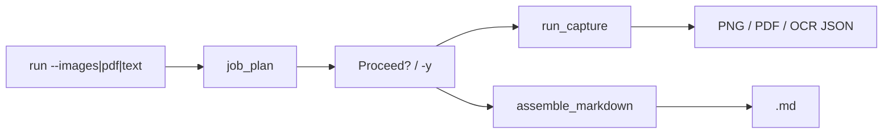

# ebook_capture

화면의 고정 영역(또는 지정 창)을 연속 캡처해 PNG를 모으고, 선택에 따라 **이미지 PDF** 또는 **Google Gemini OCR + Markdown**까지 만드는 도구입니다. CLI와 PyQt5 GUI를 제공합니다.

**상세 사용법:** [`USAGE.md`](USAGE.md)

## 출력 3종

| output | 생성물 | 설명 |
|--------|--------|------|
| **images** | `tmp/{title}_NNNN.png` | 페이지 캡처만 |
| **pdf** | PNG + `{title}.pdf` | 이미지 PDF (기본) |
| **text** | `*.ocr.json` + `{title}.md` | OCR → JSON → Markdown 조립 |

`config`의 `output_mode`와 CLI의 `--images` / `--pdf` / `--text`는 동일한 값입니다.

## 프로젝트 구성

```
cli.py                         # gui | run
default_config.json            # bundled 기본 설정 (CaptureConfig)
assets/
  ocr_default_prompt.txt       # Gemini OCR 기본 프롬프트
  ocr_lang.csv                 # OCR 언어 힌트 목록
core/
  config.py                    # CaptureConfig (JSON 직렬화)
  job_plan.py / job_runner.py  # 산출물 분석 · 단계 확인 · 실행
  pipeline.py                  # 캡처 · OCR · PDF (Qt 없음)
  google_ocr.py                # Google Gemini OCR
  image_pdf.py                 # PNG → 이미지 PDF
  assemble_*.py                # OCR JSON → Markdown
gui/
  app.py                       # PyQt 다이얼로그 → `run -y` 서브프로세스
tests/                         # pytest
```

### 설계 요약

| 레이어 | 역할 |
|--------|------|
| **core** | Win32/pyautogui 캡처, Gemini OCR, PDF/Markdown 생성. GUI 없이 동작. |
| **cli** | `run`: `--images` / `--pdf` / `--text`. 필요 단계를 분석해 사용자 확인 후 실행. |
| **gui** | 옵션을 JSON으로 저장하고 `python -m ebook_capture run -y --config …`를 **서브프로세스**로 실행. |



## 설치

```bash
cd /path/to/ebook_capture
pip install -e .
# 개발·테스트:
pip install -e ".[dev]"
```

Python **3.10+** 권장.

## 빠른 시작

### GUI

```bash
python -m ebook_capture gui
# 또는 (editable 설치 후)
ebook-capture gui
```

1. **Folder**: 출력 상위 폴더 (절대 경로).
2. **Title**, **Pages**: 책 제목과 페이지 수.
3. **Output**: Images / PDF / Text (OCR).
4. **Start**: `run -y` 서브프로세스 실행. Text 모드는 OCR + Markdown까지 포함.

### CLI

```bash
python -m ebook_capture run --config default_config.json --pdf
python -m ebook_capture run --title "My Book" --base-dir E:/ebook --text -y
```

중간 산출물(PNG, PDF, OCR JSON 등)이 없으면 **실행할 단계 목록**을 보여 주고 확인을 받습니다. 스크립트·GUI는 `-y`로 건너뜁니다.

```bash
python -m ebook_capture run --help
```

## 저장 경로

```
{base_dir}/{title}/
  tmp/{title}_0001.png
  tmp/{title}_0001.ocr.json
  {title}.pdf
  {title}.md
  {title}_structure.json
  capture_state.json          # resume 상태
```

## 환경 변수

- **Google OCR**: `.env` 또는 환경 변수에 `GOOGLE_API_KEY`. `python-dotenv` + `google-genai` 사용.
  - 사내망: `GOOGLE_API_TRUST_MODE=auto` (Windows 인증서 저장소 우선).
  - open망: `GOOGLE_API_TRUST_MODE=certifi`.
  - 필요 시 `GOOGLE_API_CA_BUNDLE=<CA .cer/.pem>`.
- 예시: [`.env.example`](.env.example)

구현·SSL·캡처 백엔드·resume 등 내부 가이드: [`GUIDE.md`](GUIDE.md)  
CLI/GUI 흐름: [`FLOW.md`](FLOW.md)

## 라이선스

개별 파일에 다른 라이선스가 붙어 있을 수 있습니다. 새 패키지 코드는 프로젝트 정책에 맞게 정리하세요.
