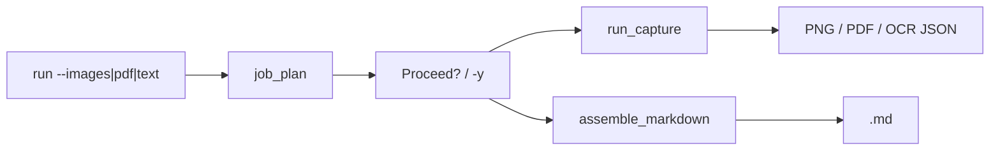

# ebook_capture

화면의 고정 영역(또는 지정 창)을 연속 캡처해 PNG를 모으고, 선택에 따라 **이미지 PDF** 또는 **Google Gemini OCR + Markdown**까지 만드는 도구입니다. CLI와 PyQt5 GUI를 제공합니다.

| 문서 | 대상 |
|------|------|
| [USAGE.md](USAGE.md) | **사용자** — 설치 후 사용법, 옵션, 리더 프로필 |
| [REQUIREMENTS.md](REQUIREMENTS.md) | **개발자** — 요구사항, 아키텍처, 파이프라인, 문제/해결책 |
| [CONTEXT.md](CONTEXT.md) | **다음 세션** — Kindle 검증 상태, 다른 리더 튜닝 TODO |

## 출력 3종

| output | 생성물 | 설명 |
|--------|--------|------|
| **images** | `tmp/{title}_NNNN.png` | 페이지 캡처만 |
| **pdf** | PNG + `{title}.pdf` | 이미지 PDF (기본) |
| **text** | `*.ocr.json` + `{title}.md` | OCR → JSON → Markdown 조립 |

`config`의 `output_mode`와 CLI의 `--images` / `--pdf` / `--text`는 동일한 값입니다.

## 프로젝트 구성

```text
cli.py                         # gui | run | test-key | inspect
default_config.jsonc           # 기본 CaptureConfig
reader_profiles.jsonc          # Kindle / Aladin 등 리더 동작
assets/                        # OCR 프롬프트, 언어 CSV
core/                          # 캡처 · OCR · PDF · assemble (Qt 없음)
gui/                           # PyQt → run -y 서브프로세스
tests/
```


```mermaid
flowchart LR
  run["run --images|pdf|text"] --> plan[job_plan]
  plan --> confirm["Proceed? / -y"]
  confirm --> pipeline[run_capture]
  confirm --> assemble[assemble_markdown]
  pipeline --> out["PNG / PDF / OCR JSON"]
  assemble --> md[".md"]
```

## 설치

```bash
cd /path/to/ebook_capture
pip install -e .
# 개발·테스트:
pip install -e ".[dev]"
```

Python **3.10+** 권장. Windows 캡처·창 제어가 주 대상입니다.

## 빠른 시작

### GUI

```bash
python -m ebook_capture gui
```

1. **Reader**에서 Kindle / Aladin 등 선택  
2. **Folder / Title / Pages**, 대상 창 선택  
3. **Output** → **Start**

### CLI

```bash
python -m ebook_capture run --config default_config.jsonc --reader kindle_app --pdf -y
python -m ebook_capture run --title "My Book" --base-dir E:/ebook --text -y
```

중간 산출물이 없으면 실행 단계를 보여 주고 확인합니다. `-y`로 생략합니다.

## 저장 경로

```text
{base_dir}/{title}/
  tmp/{title}_0001.png
  tmp/{title}_0001.ocr.json
  {title}.pdf
  {title}.md
  capture_state.json
```

## 환경 변수 (OCR)

- `GOOGLE_API_KEY` — Gemini OCR (`--text`)에 필요  
- `GOOGLE_API_TRUST_MODE` — `auto` | `system`(사내망) | `certifi`  
- 예시: [`.env.example`](.env.example)

## 라이선스

개별 파일에 다른 라이선스가 붙어 있을 수 있습니다. 새 패키지 코드는 프로젝트 정책에 맞게 정리하세요.
