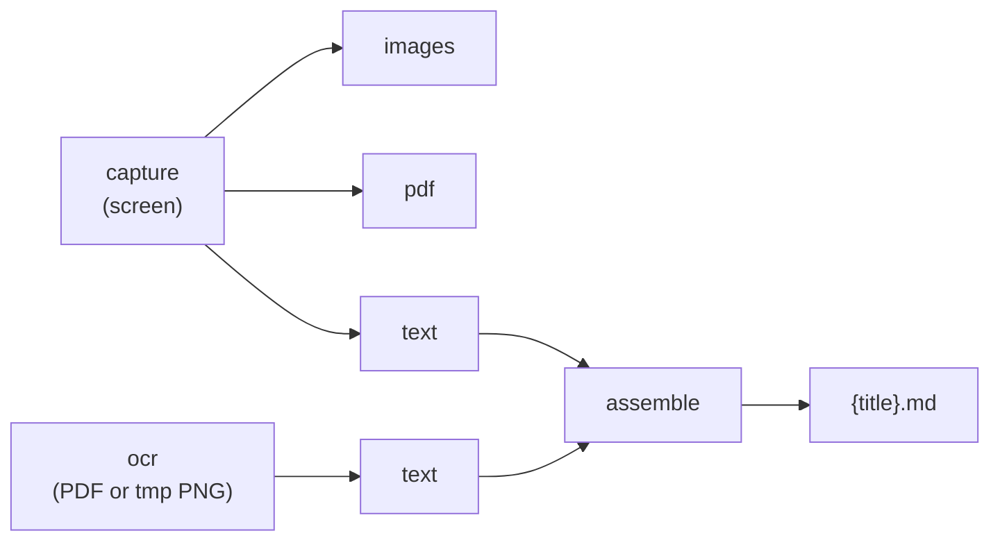

# Refactor Plan — output 기준 재구성

**상태:** Phase 1–3 구현 완료 (2026-05)  
**기준 문서:** `USAGE.md`

---

## 1. 설계 원칙

모든 작업은 **출력 3종**으로만 표현한다.

| output | 생성물 | 명령 |
|--------|--------|------|
| **images** | `tmp/*.png` | `capture --images` |
| **pdf** | `tmp/*.png` + `{title}.pdf` | `capture --pdf` (기본) |
| **text** | `tmp/*.txt` + `*.ocr.json` | `capture --text` 또는 `ocr` |

Markdown은 별도 출력 타입이 아니라 **`assemble`** 명령이 `text` JSON을 소비한다.



---

## 2. 완료된 작업

### 2.1 Config 단일화 (`core/config.py`)

| Before | After |
|--------|-------|
| `output_mode`: images / text / pdf_image | **images / pdf / text** |
| `capture_images`, `build_pdf`, `ocr` | **삭제** |
| `run_*_phase` 필드 6개 | **`@property`** — output_mode에서 파생 |
| `apply_output_mode()` | **`normalize()`** |
| 레거시 alias | `pdf_image` → `pdf` 등 load 시 변환 |

`skip_capture=True` → 기존 PNG/PDF만 OCR (`ocr` 명령).

### 2.2 CLI 재구성 (`cli.py`)

| 명령 | 역할 |
|------|------|
| `capture` | 화면 캡처 → `--output images\|pdf\|text` |
| `ocr [pdf]` | **text** 출력 (PDF 또는 tmp PNG) |
| `assemble` | OCR JSON → Markdown |
| `gui` | GUI |

**삭제·deprecated**

- `--phase`, `--no-images`, `--no-pdf`, `--ocr`, `--no-ocr`, `--input-pdf`(capture에서)
- `--pdf-image` → `--pdf`
- `ocr-pdf` → `ocr <pdf>` alias (deprecated 경고)
- `assemble-md` → `assemble` alias
- assemble `--body-only`, `--no-merge-paragraphs`

### 2.3 Dead code 삭제

| 파일 | 조치 |
|------|------|
| `core/tts.py` | 삭제 |
| `assets/voice_lang.csv` | 삭제 |
| `core/searchable_pdf.py` | **`core/image_pdf.py`** 로 rename |

### 2.4 default_config.json 슬림화

`output_mode: "pdf"` 하나 + 캡처/OCR/assemble 설정만 유지.

### 2.5 GUI (`gui/app.py`)

- Output 콤보: **Images / PDF / Text (OCR)**
- 숨겨진 `cb_img/pdf/ocr` 참조 제거
- Assemble → `assemble` subprocess

### 2.6 테스트

59 tests passing — config phases, CLI parser, assemble smoke.

---

## 3. 남은 작업 (Phase 4+)

| 우선 | 항목 | 설명 |
|:----:|------|------|
| P1 | **USAGE.md 전면 개정** | `capture`/`ocr`/`assemble` 기준으로 rewrite |
| P1 | **README.md** | TTS/searchable 제거, USAGE 링크 |
| P2 | **FLOW.md / GUIDE.md** | archive 또는 USAGE에 흡수 |
| P2 | **`core/assemble/` 패키지** | 7파일 namespace 정리 (동작 변경 없음) |
| P2 | **`pipeline.py` 테스트** | resume / force-phase mock |
| P3 | **GUI resume 토글** | CLI와 동일 |
| P3 | **Windows CI** | Win32 캡처 integration |

---

## 4. 마이그레이션 가이드

| Old | New |
|-----|-----|
| `output_mode: pdf_image` | `output_mode: pdf` |
| `capture --pdf-image` | `capture --pdf` |
| `capture --input-pdf x.pdf --text` | `ocr x.pdf` |
| `ocr-pdf x.pdf` | `ocr x.pdf` |
| `assemble-md` | `assemble` |
| `--body-only` | `assemble --style prose` |
| `capture_images` / `ocr` / `build_pdf` in JSON | **`output_mode`만** |

---

## 5. 파일 맵 (현재)

```
cli.py                 # gui | capture | ocr | assemble (+ aliases)
core/
  config.py            # output_mode → phases
  pipeline.py          # run_capture()
  image_pdf.py         # PNG → PDF
  google_ocr.py        # Gemini OCR
  assemble_*.py        # Markdown pipeline
  text_reflow.py       # 줄바꿈 정리
default_config.json    # output_mode: pdf
USAGE.md               # 사용자 매뉴얼 (업데이트 필요)
REFACTOR_PLAN.md       # 본 문서
```
