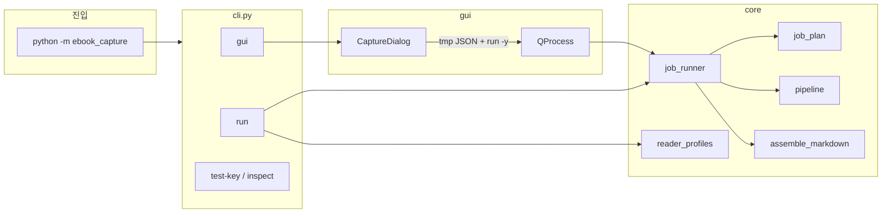

# ebook_capture — Requirements & Architecture (개발자용)

사용자 매뉴얼: [`USAGE.md`](USAGE.md)  
제품 개요·설치: [`README.md`](README.md)

이 문서는 **요구사항, 아키텍처, 설계 결정, 모듈 책임, 파이프라인, 재사용 포인트**를 정리한다.  
(구 `FLOW.md` / `GUIDE.md` / `TRANSFER_CONTEXT.md`를 통합·갱신.)

---

## 1. 목적 · 범위

Windows에서 전자책 리더(앱/웹) 화면을 연속 캡처하고, 선택에 따라 **이미지 PDF** 또는 **Gemini OCR → Markdown**을 만든다.

| 출력 (`output_mode`) | 산출물 |
|----------------------|--------|
| `images` | `tmp/{title}_NNNN.png` |
| `pdf` (기본) | PNG + `{title}.pdf` |
| `text` | `*.ocr.json` + `{title}.md` (+ 중간 `_ocr.txt`) |

지원 환경: Windows, RDP/DPI/다중 모니터, 사내망 SSL(프록시 CA).

비범위: DRM 우회, 비-Windows 1급 지원, GUI 내부에서의 장시간 캡처 루프.

---

## 2. 기능 요구사항

### 2.1 캡처

- 영역: `manual` | `window_full` | `window_left_third` | `window_right_third` | `screen_left_third`
- 시작 시 창 resize/포커스는 옵션 (`fit_on_start`, `start_focus_clicks`; 기본 끔)
- 페이지 넘김: `next_key` + `key_delivery` (SendInput / PostMessage / PyAutoGUI / auto)
- 포커스: 시작 1회(`start_focus_clicks`)와 **캡처 직전** 매 페이지(`reader_focus_clicks`) 분리
  - 클릭 위치: `reader_focus_x_ratio` / `reader_focus_y_ratio` (기본 중앙 0.5)
  - 클릭 후: 포인터를 캡처 영역 밖으로 빼고 `focus_click_settle_sec` 대기 (기본 1.0초)
  - 페이지 순서: **클릭 → settle → 캡처 → next_key → delay** (`tests/test_capture_order.py`)
- 커서 숨김: `hide_cursor_during_capture` (화면 캡처 백엔드용)
- 백엔드: `printwindow` (HWND) | `screen` (mss)

리더별 클릭/키/활성화 함정은 §12에 정리.

### 2.2 잡 계획 · 재개

- `plan_job()`이 기존 산출물을 보고 필요한 단계만 제안; `-y` 없으면 확인
  - PNG는 **설정된 페이지 범위 전부 있는지** 본다 (`png_complete`). 일부만 있으면 캡처를 resume한다 (any-PNG로 통째 skip하지 않음).
- 페이지 단위 resume: `capture_state.json` + 파일 검증; `.part` → `os.replace`
- `--force-phase capture|ocr|pdf|all`, `--no-resume`

### 2.3 OCR / Markdown / PDF

- OCR: Google Gemini (`core/google_ocr.py` 단일 진입점)
- Markdown: `assemble_style` = `full` | `prose` | `raw`
- PDF: PNG → 페이지 PDF → merge; `pdf_trim`은 **캡처 해상도 비율**로 상하좌우 crop

### 2.4 리더 프로필

- `reader_profiles.jsonc` + `core/reader_profiles.py`
- CLI `--reader` / GUI Reader 콤보 / config `reader_profile`
- 우선순위: **개별 CLI 플래그 > 프로필 > config 기본값**
- 내장 예: `kindle_app`, `kindle_cloud`, `aladin_app`, `aladin_web`
- **공통 루프 knobs**는 `_proven_capture_defaults()` (`kindle_app` 검증분). 리더마다
  다른 것은 `next_key` / `key_delivery` / `target_window_title` / `pdf_trim` / note뿐.
- 다음 세션 튜닝 TODO: [`CONTEXT.md`](CONTEXT.md)

### 2.5 CLI / GUI

| 명령 | 역할 |
|------|------|
| `run` | 메인 잡 (`--images` / `--pdf` / `--text`) |
| `gui` | 옵션 UI → temp JSON → `run -y` 서브프로세스 |
| `test-key` | 페이지 넘김 키 스모크 |
| `inspect` | 창/캡처 rect 진단 |

GUI는 캡처 루프를 돌리지 않는다. core는 Qt에 의존하지 않는다.

---

## 3. 아키텍처



### 레이어

| 레이어 | 책임 |
|--------|------|
| **core** | 설정, 캡처, OCR, PDF, assemble, 프로필. headless. |
| **cli** | argparse, 설정 병합, 진단 명령 |
| **gui** | 옵션 수집·로그 표시; 실행은 subprocess |

### 소스 맵

```text
cli.py / ebook_capture.py
core/
  config.py              CaptureConfig, PdfTrim, JSONC 로드
  reader_profiles.py     리더별 동작 오버레이
  job_plan.py            산출물 → 단계 계획
  job_runner.py          plan → confirm → pipeline / assemble
  pipeline.py            Phase I/II/III (capture / OCR / PDF)
  windows_util.py        HWND, fit, key delivery, focus clicks
  win32_bitmap_capture.py PrintWindow
  screen_capture.py      mss / pyautogui region
  google_ocr.py          Gemini OCR + SSL trust
  image_pdf.py           PNG → PDF (+ ratio trim)
  assemble_*.py          OCR JSON → Markdown
gui/
  app.py                 Dialog ↔ CaptureConfig ↔ QProcess
default_config.jsonc
reader_profiles.jsonc
assets/                  OCR 프롬프트, 언어 CSV
tests/
```

---

## 4. 설정 모델 (`CaptureConfig`)

공유 스키마. GUI와 CLI가 동일 JSON을 쓴다.

파일 분리:

| 파일 | 담는 것 |
|------|---------|
| `default_config.jsonc` (책) | `title`, `base_dir`, `n_pages`, `start_page`, `output_mode`, `reader_profile`(이름), `resume`, `force_phase`, OCR/assemble |
| `reader_profiles.jsonc` (리더) | `capture_mode`, `target_window_title`, `next_key`, `key_delivery`, `delay_sec`, focus/fit, `pdf_trim`, backend… |

런타임 `CaptureConfig`는 둘을 merge한 결과. 주요 필드 그룹:

| 그룹 | 필드 | 주로 있는 파일 |
|------|------|----------------|
| 책/출력 | `title`, `base_dir`, `n_pages`, `start_page`, `output_mode`, `assemble_style` | 책 |
| 잡 | `resume`, `force_phase`, `skip_capture`, `input_pdf`, `reader_profile` | 책 |
| OCR | `ocr_lang`, `ocr_text_prompt`, `ocr_prompt_file` | 책 |
| 캡처 | `capture_mode`, `target_window_title`, `rect`, `window_capture_backend`, `use_window_client_rect`, `hide_cursor_during_capture`, `delay_sec` | 리더 |
| 키 | `next_key`, `key_delivery` | 리더 |
| 캡처 전 포커스 | `reader_focus_clicks`, `reader_focus_x_ratio`, `reader_focus_y_ratio`, `focus_click_settle_sec` | 리더 |
| 시작 | `fit_on_start`, `start_focus_clicks`, `start_focus_x_ratio`, `start_focus_y_ratio` | 리더 |
| PDF | `pdf_trim` (`left/right/top/bottom` 비율 0–0.45) | 리더 |

경로 규칙:

```text
{base_dir}/{title}/
  tmp/{title}_0001.png|.ocr.json|.page.pdf
  {title}.pdf | {title}.md | {title}_structure.json
  capture_state.json
```

Phase 파생:

- `run_capture_phase` — skip/PDF입력 아님
- `run_ocr_phase` — `output_mode == text`
- `run_pdf_phase` — `output_mode == pdf` (**`skip_capture`와 무관** — 기존 PNG만으로 PDF 가능)

---

## 5. 실행 흐름

### 5.1 `run`

1. config 로드 (`--config` 또는 title+base-dir)
2. `--reader` / `reader_profile` 적용
3. CLI 플래그로 덮어쓰기
4. `plan_job` → `confirm_steps` (`-y`면 생략)
5. 필요 시 `run_capture` → 필요 시 `assemble_markdown`

### 5.2 Job plan (`output_mode`)

| output | 단계 |
|--------|------|
| images | CAPTURE |
| pdf | CAPTURE → BUILD_PDF |
| text | CAPTURE/OCR(PNG\|PDF) → ASSEMBLE |

text OCR 소스 우선순위: `tmp/*.png` → `{title}.pdf`/`--input-pdf` → 캡처 가능 시 CAPTURE.

### 5.3 Pipeline 시작 (`_pin_capture_target`)

1. 대상 창 pin
2. `fit_on_start`이면 left-third @ (0,0)로 resize (기본 끔)
3. `start_focus_clicks` (기본 0)
4. `pinned_capture_rect` 고정 후 페이지 루프

첫 캡처 직전에 `delay_sec` 대기(`CAPTURE_SETTLE`).

페이지마다: `READER_FOCUS` → 포인터 대피 + settle → 캡처 → (다음이면) `TARGET_KEY_SENT` +
`delay_sec`. `debug_capture`면 `DEBUG_KEY_EFFECT`로 키 효과 확인. 함정·해결은 §12.

---

## 6. 설계 원칙

1. **GUI와 장시간 작업 분리** — GUI freeze / Qt↔Win32 혼합 방지
2. **민감정보는 `.env`만** — 키·인증서 경로 하드코딩 금지
3. **외부 API는 한 모듈** — `google_ocr.py`에 Client/SSL 집중
4. **원자적 쓰기** — `.part` 후 `os.replace`
5. **manifest + 파일 검증** — resume 시 상태만 믿지 않음
6. **캡처 / OCR / PDF 분리** — OCR 실패가 PNG를 망가뜨리지 않음
7. **리더 차이는 프로필로** — 코드 분기 대신 `reader_profiles.jsonc`

---

## 7. 캡처 구현 메모 (Windows / RDP)

| API | 의미 |
|-----|------|
| `GetWindowRect` | 외곽 frame (타이틀바 포함) |
| `GetClientRect` + `ClientToScreen` | client 원점/크기 |
| `GetWindowInfo.rcClient` | 화면 좌표 client (DPI 주의) |

백엔드:

- **printwindow**: RDP/창 캡처에 유리 (HWND 비트맵)
- **screen**: mss 영역 캡처; DPI·멀티모니터 좌표에 민감. `screen_left_third`에 권장

검은 이미지 디버그 순서: HWND/제목 → backend → rect → DPI. 원인을 trim으로 가리지 말 것.

로그 토큰: `DEBUG_RECT`, `READER_FIT`, `START_FOCUS`, `CAPTURE_SETTLE`, `READER_FOCUS`,
`POINTER_HIDE` / `POINTER_RESTORE`, `TARGET_KEY_SENT`, `DEBUG_KEY_EFFECT`, `IMAGE_OK`,
`OCR_*`, `PDF_*`, `CAPTURE_SKIP`.

---

## 8. OCR · SSL · PDF

### OCR

- 기본 모델: `gemini-2.5-flash` (`GOOGLE_OCR_MODEL`로 교체)
- layout JSON: `bbox`는 이미지 대비 정규화 `0..1`
- 프롬프트: 순수 JSON 요청; fence 허용하되 파싱 실패는 명확히

### SSL (`GOOGLE_API_TRUST_MODE`)

| 값 | 용도 |
|----|------|
| `auto` | OS trust → certifi |
| `system` | 사내 Windows/프록시 |
| `certifi` | open망 |

추가 CA: `GOOGLE_API_CA_BUNDLE` (PEM 또는 DER `.cer`). `verify=False`는 표준으로 쓰지 않음.

### PDF trim

`pdf_trim.left` 등이 캡처 폭/높이의 비율. 예: 1000px 폭 + `left=0.02` → 20px crop. 해상도 변경에도 비율 유지.

---

## 9. Resume

- 상태: `{base_dir}/{title}/capture_state.json`
- PNG: 존재·비어있지 않음·Pillow verify
- OCR JSON: parse + 구조
- PDF: 존재·비어있지 않음
- **캡처 resume 주의**: 뷰어가 다음에 찍을 페이지에 맞춰져 있어야 함. OCR/PDF는 파일 기반이라 안전.

---

## 10. 테스트 · 개발

```bash
pip install -e ".[dev]"
pytest
```

주요 테스트: `tests/test_config.py`, `test_reader_profiles.py`, `test_image_pdf_trim.py`,
`test_capture_order.py`, `test_windows_key.py`, `test_screen_rect.py`, …

문서 갱신 규칙:

- 사용자 옵션/절차 → [`USAGE.md`](USAGE.md)
- 아키텍처·요구·내부 제약·**문제/해결책** → 이 파일
- README는 짧은 개요 + 링크로 유지

---

## 11. 다른 프로젝트로 이식할 때

권장 순서:

1. `CaptureConfig` + path helper
2. `.part` atomic write + page manifest
3. `google_ocr` (또는 동등 API 단일 모듈) + truststore
4. Windows capture util / backend 분리
5. GUI는 옵션+로그만, worker는 CLI/subprocess

해결해 둔 문제 요약: RDP/DPI 좌표, PrintWindow vs screen, 커서 포함, 사내 SSL, Gemini OCR,
resume, CLI/GUI 분리, 리더별 키/포커스 프로필, WinUI(Kindle) Alt/SetFocus/더블클릭 함정.

---

## 12. 발견한 문제 · 해결책

Kindle for PC / Cloud Reader 검증과 파이프라인 디버깅에서 확정한 것. 증상만 보고 추측하지
말고, `--debug-capture`의 `DEBUG_KEY_EFFECT`로 키 효과부터 가른다.

### 12.1 잡이 바로 `DONE` (캡처가 안 도는 것처럼 보임)

| | |
|--|--|
| **증상** | `run`이 Phase I 없이 즉시 끝나거나, PNG는 있는데 PDF가 안 만들어짐 / `PDF_MISSING_IMAGE` |
| **원인** | (1) 과거: resume이 **아무** `tmp/*.png`만 있어도 캡처 전체를 skip (`CAPTURE_SKIP`) → 뒤 페이지 없이 PDF 시도. (2) 과거 버그: `run_pdf_phase`가 `skip_capture`에 묶여 PDF merge도 같이 스킵됨 |
| **해결** | `plan_job`은 페이지 범위 전부가 있을 때만 capture skip (`png_complete`). 부분 캡처는 resume 후 PDF. `run_pdf_phase`는 capture skip과 독립. 강제 재캡처 시 `--force-phase capture` / `--no-resume`. 중단 후 재개: **같은** `--start-page`/`--pages`(보통 1부터 전체)로 다시 실행 |

### 12.2 Kindle Cloud: 페이지 대신 줌/폰트(Aa)

| | |
|--|--|
| **증상** | Cloud Reader에서 `right`가 줌/Aa로 동작 |
| **원인** | 캡처 영역 **상단** 클릭이 Kindle 클라우드 UI(Aa/줌 툴바)를 연다 |
| **해결** | 프로필 `kindle_cloud`: `reader_focus_clicks=0`. 사용자가 본문을 한 번 클릭한 뒤 Start |

### 12.3 Kindle 앱: 표지/이미지 페이지가 줌됨

| | |
|--|--|
| **증상** | 같은 표지가 확대되어 찍힘. `next_key` 이후에도 페이지가 안 넘어감(줌 모드에서 키는 패닝) |
| **원인** | `reader_focus_clicks=2`가 같은 좌표를 **짧은 간격(구 60ms)** 으로 눌러 Windows가 `WM_LBUTTONDBLCLK`로 합성. Kindle은 이미지 더블클릭을 줌으로 처리 |
| **해결** | `_reader_focus_clicks` 간격을 `GetDoubleClickTime() + margin` 이상으로. docstring의 “not a double-click”을 코드가 지키도록 고정 (`tests/test_windows_key.py`) |

### 12.4 Kindle 앱: 키는 `ok=True`인데 페이지가 안 넘어감 (홀수/짝수)

| | |
|--|--|
| **증상** | `TARGET_KEY_SENT … ok=True`인데 화면 불변. 직접 `SendInput`은 되고 CLI 루프에서는 실패. “한 번 걸러 한 번” 성공처럼 보이기도 함 |
| **원인** | `force_foreground_hwnd`가 **매번** `_unlock_foreground_for_automation`(합성 **Alt** 탭)을 호출. Alt가 WinUI 앱의 메뉴/액셀러레이터 모드를 **토글**. 모드 ON이면 화살표가 메뉴로 가서 페이지 불변. CLI는 페이지당 활성화를 여러 번 호출 → 홀수 토글에 걸리면 전부 실패 |
| **해결** | (1) 이미 포그라운드면 `force_foreground_hwnd` 즉시 반환(Alt 안 보냄). (2) Alt는 AttachThreadInput/`SetForegroundWindow`가 **모두 실패한 최후 수단**만. (3) 이미 포그라운드+자체 포커스면 `focus_window_for_keyboard`도 no-op (`SwitchToThisWindow`/`SetFocus` 재호출도 키를 죽임). 회귀: `test_already_foreground_window_is_not_reactivated` |

### 12.5 Kindle 앱: `SetFocus` 후 SendInput이 무반응

| | |
|--|--|
| **증상** | `sendinput+SetFocus(top)` 실패, `SendInput`만(포커스 유지)은 성공 |
| **원인** | Kindle(WinUI 3, `Microsoft.UI.Windowing.Window`)은 키보드 포커스를 숨은 `InputSiteWindowClass` 자식이 가짐. 프레임에 `SetFocus`하면 포커스가 빠져 키가 드롭 |
| **해결** | `has_internal_keyboard_focus` / `wait_for_internal_keyboard_focus` — 대상 스레드가 이미 포커스를 들고 있으면 그대로 두고 SendInput만. 포그라운드 직후 포커스 HWND가 잠시 비어 보이므로 **폴링** |

### 12.6 첫 페이지가 스피너/레터박스(검은 띠)

| | |
|--|--|
| **증상** | page#1만 상하 검정 또는 로딩 스피너, 이후는 정상 |
| **원인** | 창을 포그라운드로 올린 직후 리더가 아직 본문을 그리기 전 |
| **해결** | 첫 실캡처 전 `CAPTURE_SETTLE` = `delay_sec` 대기 |

### 12.7 캡처 이미지에 툴바·페이지 화살표·진행바가 남음

| | |
|--|--|
| **증상** | 본문 위/아래에 Kindle UI 오버레이가 찍힘 |
| **원인** | (1) 클릭이 오버레이를 띄운 뒤 **바로** 캡처. (2) 포인터 대피 좌표를 화면 밖(`top-24`)으로 보내면 OS가 클램프해 **앱 상단 바**에 올려 호버 툴바가 유지됨. (3) 예전 루프는 캡처 **후**에 focus click |
| **해결** | 순서: 본문 중앙 클릭 → 포인터를 **옆으로** 대피(화면 안·캡처 밖) → `focus_click_settle_sec`(~0.5초 실측, 기본 1.0) → 캡처 → `next_key`. `kindle_app` 기본 클릭 위치 `(0.5, 0.5)` |

### 12.8 Kindle 앱 상단 크롬이 페이지에 포함

| | |
|--|--|
| **증상** | PDF/PNG 상단에 Kindle 뒤로·설정·창 버튼 띠 |
| **원인** | 앱이 커스텀 크롬을 **client 영역 안**에 그림 → `use_window_client_rect`로도 안 잘림 |
| **해결** | `kindle_app` 프로필 `pdf_trim.top=0.032` (1592px 높이에서 ~48px 실측, 비율). 창 높이를 크게 바꾸면 재측정 |

### 12.9 GUI ↔ CLI 옵션 불일치

| | |
|--|--|
| **증상** | GUI에 `screen_left_third` / `key_delivery` / resume·force 등 누락 또는 roundtrip 손실 |
| **해결** | `CaptureConfig` 단일 스키마. GUI 위젯 ↔ `from_mapping`/`to_json` 전 필드 동기. 우선순위: **개별 CLI 플래그 > `--reader` 프로필 > config** |

### 12.10 진단 절차 (재발 시)

1. Kindle을 줌/메뉴 아닌 **정상 읽기** 상태로 두고, 툴바·화살표가 숨은 첫 페이지에서 시작.
2. `tmp`의 이전 PNG를 지우거나 `--force-phase capture`.
3. `--debug-capture`로 실행:
   - `DEBUG_KEY_EFFECT … (page moved)` → 키 OK, 캡처/trim 쪽 볼 것.
   - `NO VISIBLE CHANGE` → Alt/포커스/배달 경로. `key_delivery=pyautogui` 시도, 다른 창 클릭 금지.
4. 연속 PNG meandiff(축소 grayscale 차)로 “같은 화면 반복”인지 확인.
