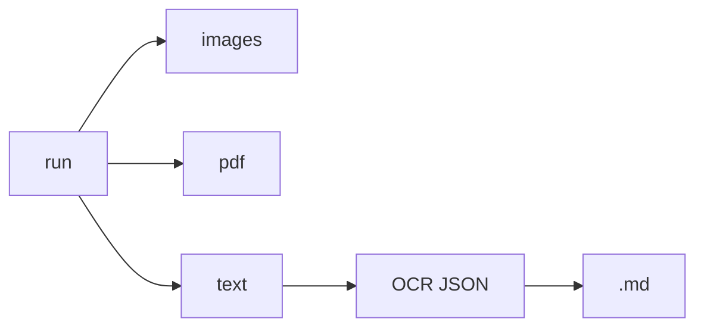

# ebook_capture 사용법

출력 **3종** — `images` | `pdf` | `text` — 과 CLI **`run`** 명령으로 정리된 매뉴얼입니다.  
개요·설치: [README.md](README.md)

```cmd
python -m ebook_capture run [options]
```

---

## 1. 출력 타입 (output)

| output | 생성 파일 | 설명 |
|--------|-----------|------|
| **images** | `tmp/{title}_NNNN.png` | 페이지 캡처만 |
| **pdf** | PNG + `{title}.pdf` | 이미지 PDF (기본) |
| **text** | `*.ocr.json` + `{title}.md` | OCR → JSON → Markdown 조립 |

`--text` 는 **한 번에** OCR·JSON·assemble 까지 수행합니다.  
소스 우선순위: `tmp/*.png` → `{title}.pdf` / `--input-pdf` → (없으면) 화면 캡처.



---

## 2. 명령어

| 명령 | 설명 |
|------|------|
| `gui` | PyQt5 GUI |
| **`run`** | `--images` / `--pdf` / `--text` 중 하나 실행 |

---

## 3. run

```cmd
python -m ebook_capture run --config default_config.json --pdf
python -m ebook_capture run --title "My Book" --base-dir E:\ebook --text -y
python -m ebook_capture run --config cfg.json --text --input-pdf book.pdf
```

### 출력 선택 (하나만)

| 옵션 | output |
|------|--------|
| `--images` | images |
| `--pdf` | pdf (기본) |
| `--text` | OCR + Markdown |
| `--output images\|pdf\|text` | 위와 동일 |

### 사전 확인

필요한 중간 결과물(PNG, PDF, OCR JSON 등)이 없으면 **실행할 단계 목록**을 보여 주고 `Proceed? [Y/n]` 으로 확인합니다.

| 옵션 | 설명 |
|------|------|
| `-y`, `--yes` | 확인 없이 바로 실행 (GUI·스크립트용) |

### 필수 / 공통

| 옵션 | 설명 |
|------|------|
| `--config` | JSON 설정 |
| `--title` | 책 폴더명 |
| `--base-dir` | 출력 상위 (절대 경로) |
| `--pages` | 페이지 수 |
| `--start-page` | 시작 번호 (기본 1) |
| `--input-pdf` | `--text` 시 PNG 없을 때 PDF 소스 |
| `--style full\|prose\|raw` | Markdown 조립 스타일 (`--text`) |

### 캡처 영역

| `--capture-mode` | 추가 |
|------------------|------|
| `manual` | `--left --top --width --height` |
| `window_full` / `window_left_third` / `window_right_third` | `--window-title` 또는 `--active-window` |

### text 출력 시 OCR 옵션

| 옵션 | 설명 |
|------|------|
| `--ocr-lang` | Gemini OCR 언어 힌트 (예: `kor`, `eng`) |
| `--ocr-prompt` | Gemini OCR 프롬프트 (인라인) |
| `--ocr-prompt-file` | 프롬프트 파일 경로 |

### 재개 / 강제

| 옵션 | 설명 |
|------|------|
| `--resume` / `--no-resume` | 기존 페이지 건너뛰기 |
| `--force-phase capture\|ocr\|pdf\|all` | 해당 단계 재실행 |

---

## 4. 설정 파일 (`default_config.json`)

| 필드 | 설명 |
|------|------|
| `output_mode` | `images` \| `pdf` \| `text` (CLI `--images` 등과 동일) |
| `assemble_style` | `full` \| `prose` \| `raw` |
| `title`, `base_dir`, `n_pages`, … | CLI와 동일 |

CLI 옵션이 JSON 값을 덮어씁니다.

---

## 5. 출력 경로

```
{base_dir}/{title}/
  tmp/{title}_0001.png
  tmp/{title}_0001.ocr.json
  {title}.pdf
  {title}.md
  {title}_structure.json
```

---

## 6. 예시

**PDF만 (기본)**  
`python -m ebook_capture run --config default_config.json --pdf -y`

**이미 PNG 있음 → OCR + MD**  
`python -m ebook_capture run --title "My Book" --base-dir E:\ebook --text -y`

**외부 PDF → text**  
`python -m ebook_capture run --title Book --base-dir E:\ebook --text --input-pdf E:\in\book.pdf -y`

**OCR JSON만 있음 → assemble만**  
`python -m ebook_capture run --title Book --base-dir E:\ebook --text -y`

---

## 7. GUI

`python -m ebook_capture gui`

Output 콤보: Images / PDF / Text (OCR). Start → `run -y`.  
Text 모드면 OCR+assemble 포함. **Assemble MD** 는 OCR JSON만 있을 때 Markdown만 다시 만듭니다.
